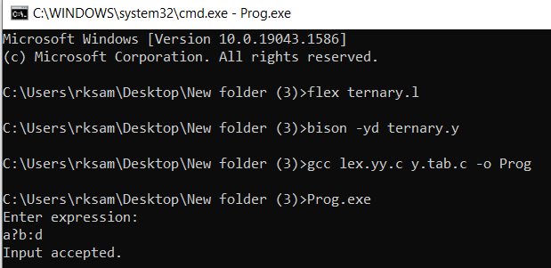

# **c/c++ Ternary operator parser**
---

```
Submitted by: 
  1. Rohit   
  2. Shivam Dixit  
  3. Gurdeep Singh

Submitted to:
  Dr. Ankit Rajpal
```

---
### **Instruction to Compile and Run the Program:**
Method 1:  Open the *'parser.cmd'* , and the program start runing automatically

Method 2: Open cmd(commad prompt) and run the following command. 
```
  1. flex ternary.l
  2. bison -yd ternary.y
  3. gcc lex.yy.c y.tab.c -o Prog
  4. Prog.exe
```

